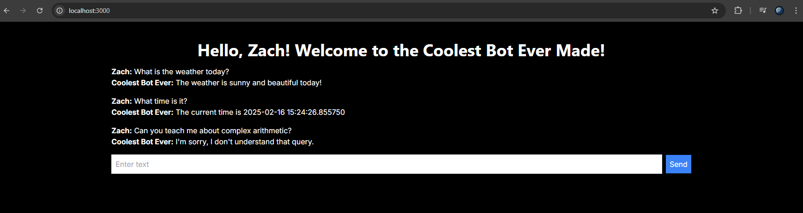

## Running the Application

## Required Software

1. Python
2. Node.js
3. Docker and Docker Compose
4. [Poetry](https://python-poetry.org/docs/#installation)
5. Postgres libpq header files (e.g. `apt install libpq-dev` on Ubuntu, `brew install postgresql` on macOS)

### First-Time Setup

1. `cd` into `backend` and run `poetry install`.
2. `cd` into `frontend` and run `npm install`.

### Running the Application

1. From the root directory, run `docker compose up`.
2. In a separate terminal, `cd` into `backend` and run `poetry run uvicorn main:app --reload`.
3. In a separate terminal, `cd` into `frontend` and run `npm run dev`.

## Using the app
___
Once the application is running, you can access the UI at [http://localhost:3000](http://localhost:3000).

The app will grant you access to a simple chatbot that can answer questions about the weather and the current time.

Try asking the chatbot questions like:
- "What is the weather today?"
- "What time is it?"

The app will also save the chat history that you have made with the chatbot.

## Future Improvements
___
To make this application more robust and production ready, we can consider the following improvements:
1. Implement a caching mechanism to cache frequently repeated responses to avoid extra API processing and DB queries. 
   - This can be done using a caching library like aiocache
   - If the application evolves to be more complex, such as processing audio inputs, we can get more fancy with caching by doing things like caching audio fingerprints or audio transcriptions.
2. Implement the ability to get multiple users chatting with the chatbot at the same time.
   - If would be useful to have a way for users to authenticate with the bot so we may identify who they are and share only their passed conversations
   - We could also support new user registration and authentication to allow users to easily create an "account" and maintain a personal chat history
3. Implement load balancing and horizontal scaling to handle more users and more complex queries.
   - We can use a load balancer like Nginx to distribute incoming requests to multiple instances of the application
   - We can also use a container orchestration tool like Kubernetes to manage the scaling of the application
4. General code improvements
   - This application was built to be a quick POC with simple approaches in mind. We can improve the code quality by adding tests, error handling, logging, and general visibility refactoring.
   - The "AI" behind this code (intent_processor.py), is extremely simple, but could be improved to handle more complex queries and intents using LLMs.